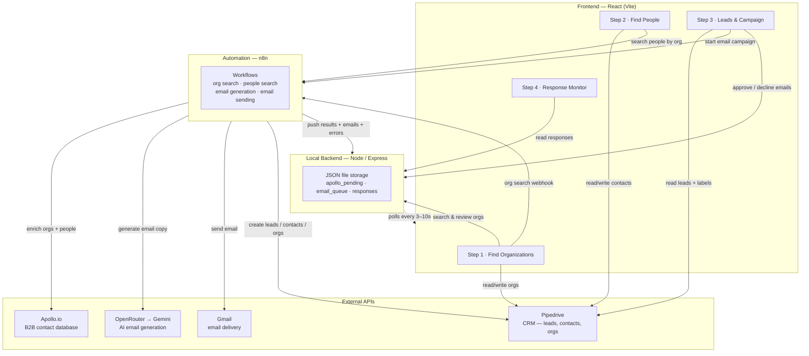

# App Architecture

```mermaid
graph TD
    subgraph Frontend["Frontend — React (Vite)"]
        Step1["Step 1 · Find Organizations"]
        Step2["Step 2 · Find People"]
        Step3["Step 3 · Leads & Campaign"]
        Step4["Step 4 · Response Monitor"]
    end

    subgraph Backend["Local Backend — Node / Express"]
        DB["JSON file storage\napollo_pending · email_queue · responses"]
    end

    subgraph Automation["Automation — n8n"]
        N8N["Workflows\norg search · people search\nemail generation · email sending"]
    end

    subgraph ExternalAPIs["External APIs"]
        Pipedrive["Pipedrive\nCRM — leads, contacts, orgs"]
        Apollo["Apollo.io\nB2B contact database"]
        OpenRouter["OpenRouter → Gemini\nAI email generation"]
        Gmail["Gmail\nemail delivery"]
    end

    Step1 -- "search & review orgs" --> Backend
    Step1 -- "org search webhook" --> Automation
    Step1 -- "read/write orgs" --> Pipedrive

    Step2 -- "search people by org" --> Automation
    Step2 -- "read/write contacts" --> Pipedrive

    Step3 -- "start email campaign" --> Automation
    Step3 -- "approve / decline emails" --> Backend
    Step3 -- "read leads + labels" --> Pipedrive

    Step4 -- "read responses" --> Backend

    Automation -- "enrich orgs + people" --> Apollo
    Automation -- "generate email copy" --> OpenRouter
    Automation -- "send email" --> Gmail
    Automation -- "create leads / contacts / orgs" --> Pipedrive
    Automation -- "push results + emails + errors" --> Backend

    Backend -. "polls every 3–10s" .-> Frontend
```
